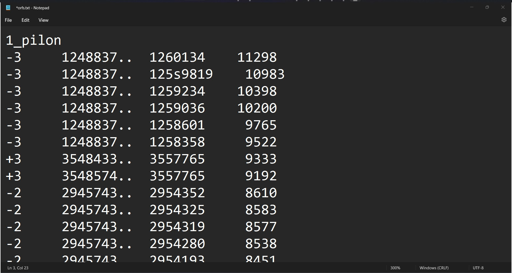

# Vanilla Python Gene finder
By Alberto Aldapa

## Problem: 
Finding all the possible genes in a genome can take a very long time if done incorrectly. Regular expressions fail at edge cases and don't allow for useful user-specified parameters such as minimum length of 
ORF.

## Solution:
A python class that takes in a fasta genome file and returns a text document containing all the potential gene locations. 

## Techniques:
- List of lists of lists
- Class init
- Commandline user parameters 
- Search algorithm
- Printing results
- Dictionaries
- Tuples

## Results:

Reference, start location, stop location, and length of each potential gene is printed one per line.

